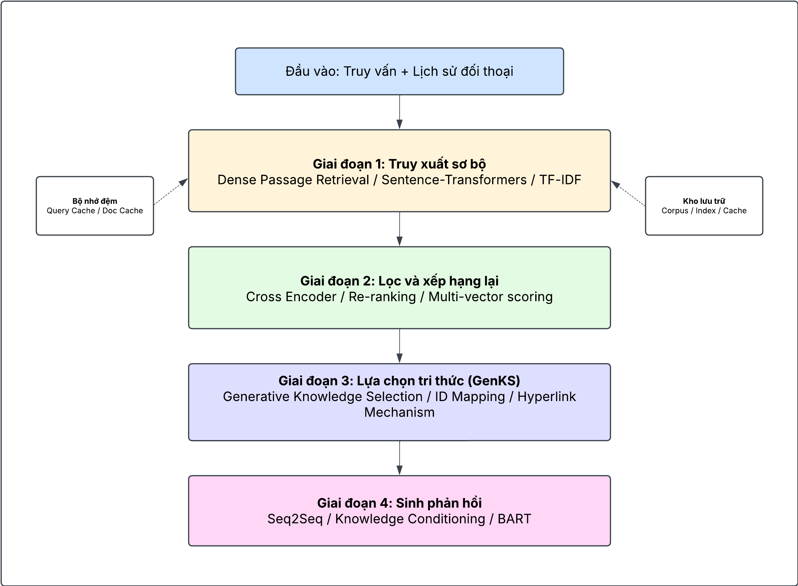

Hệ thống RAG đa giai đoạn kết hợp với GENKS đã được cải tiến
Quy trình:

1. Truy xuất sơ bộ: Sử dụng DPR hoặc SBERT để lấy tập lớn đoạn văn liên quan
2. Lọc và xếp hạng: Sử dụng mô hình xếp hạng để chọn đoạn văn liên quan nhất
3. GENKS: Sử dụng mô hình GENKS để sinh định danh tri thức với cải tiến ánh xạ ID
4. Sinh phản hồi: Sinh phản hồi dựa trên tri thức đã chọn

Mô hình kiến trúc tổng quan

